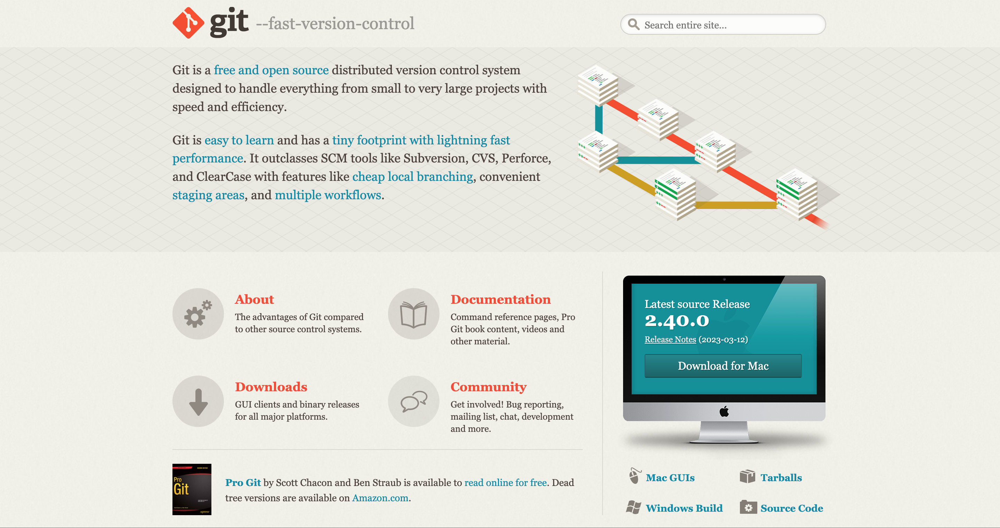

# Instalación de GIT

## Objetivos 

Al finalizar este módulo deberás de tener: 
- Una cuenta de Git vinculada con VS CODE.

## Instrucciones

* [ ] [1.- Crear una cuenta de Git](#creando-una-cuenta-de-git)
* [ ] [2.- Vincular una cuenta de Git](#vincular-la-cuenta-a-VSCODE)

## Creando una cuenta de Git

Ingresa a la página de [Git](https://git-scm.com/) y Descarga la versión más reciente de git para tu equipo.



Una vez finalizada la descarga, realiza la instalación dejando toda selección por default y dando `siguiente` a cada pantalla hasta finalizar.

## Vincular la cuenta a VSCODE
Después de realizada la instalación Git requiere de ejecutar unas instrucciones dentro de terminal o command prompt:

**Instrucción de autenticación de Nombre de usuario de Git**
```
git config --global user.name "FIRST_NAME LAST_NAME"
```

**Instrucción de autenticación de correo electrónico de usuario de git (de preferencia el que se utiliza para github)**
```
git config --global user.email "MY_NAME@example.com"
```
Nota: Si no se realiza esta autenticación antes de la vinculación de VSCODE a github saldrá un error:


Despues de finalizado este proceso cerramos terminal y nos dirigimos al control de código fuente | Source control | Control de versiones y procedemos a realizar el **Sign up for GitHub** 

Nos pedirá autorizar el ecosistema de git en nuestra cuenta de Github, le damos en autorizar y ya deberiamos poder vincular y realizar commits a repositorios en Github desde VSCODE. 